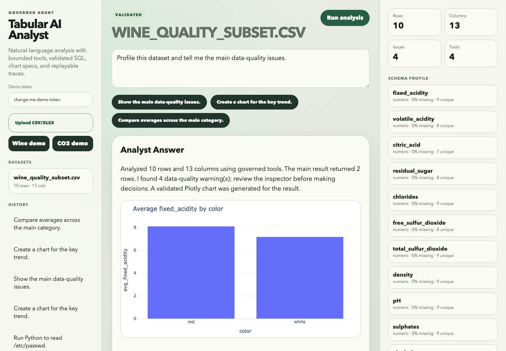

# Tabular AI Analyst

[](https://github.com/javsanesq/tabular-ai-analyst/actions/workflows/ci.yml)
[](LICENSE)

Governed AI analyst copilot for tabular data. Users upload CSV/XLSX files, ask questions in natural language, and receive validated tables, Plotly charts, data-quality warnings, and replayable tool traces.

This is designed as a flagship AI engineering portfolio project: it is not a generic chatbot over spreadsheets. The model plans analysis, but the backend owns every executable action.



## What It Demonstrates

- Strict tool-calling boundary: no generated Python execution.
- Read-only DuckDB SQL validation over uploaded datasets.
- Pandas profiling, data-quality diagnostics, and bounded transformation DSL execution.
- Plotly chart generation from validated chart specs.
- Structured analyst responses with warnings, validation status, and replayable traces.
- Postgres-backed dataset metadata, analysis history, and eval runs.
- Benchmark harness with safety traps, result-shape checks, and expected-value assertions for curated cases.
- Docker Compose, Fly.io deployment config, CI, security docs, and a polished React workbench.

## Stack

- API: FastAPI, Pydantic, SQLAlchemy, Alembic
- Analysis: Pandas, DuckDB, Plotly
- LLM: OpenAI Responses API integration with a deterministic test/demo planner
- Storage: Postgres for runtime metadata and analysis history
- UI: React, Vite, TypeScript, Plotly.js
- Deployment: Docker Compose locally, Fly.io-ready configuration

## Quickstart

```bash
git clone https://github.com/javsanesq/tabular-ai-analyst.git
cd tabular-ai-analyst
cp .env.example .env
docker compose up --build
```

Open:

- UI: [http://localhost:3000](http://localhost:3000)
- API docs: [http://localhost:8000/docs](http://localhost:8000/docs)
- Health: [http://localhost:8000/health/ready](http://localhost:8000/health/ready)

If another project already uses these ports, override the host bindings:

```bash
API_PORT=8010 UI_PORT=3010 POSTGRES_PORT=55432 docker compose up --build
```

Then open `http://localhost:3010` and use `BASE_URL=http://localhost:8010 make smoke-e2e`.

The default `.env.example` uses `LLM_PROVIDER=mock` for deterministic local demos. Set `LLM_PROVIDER=openai` and `OPENAI_API_KEY=...` for real OpenAI-backed planning. Production rejects mock mode.

## Demo Token

If `API_AUTH_TOKEN` is set, API calls require either:

```text
x-demo-key: <token>
Authorization: Bearer <token>
```

The React UI includes a demo-token field.

## Demo Datasets

The UI can load three built-in demo subsets without manually uploading files:

- Wine Quality: useful for averages, grouping, quality checks, and duplicate detection.
- OWID CO2: useful for trend charts and country comparisons.
- Video Games: useful for semantic ranking questions such as best-selling, worst-selling, publisher filters, genre filters, and year ranges.

API equivalent:

```bash
curl -H "x-demo-key: change-me-demo-token" -X POST \
  http://localhost:8000/api/v1/datasets/demo/wine-quality
```

## Local Development

```bash
python3 -m venv .venv
source .venv/bin/activate
make install
make test
make api
```

In another terminal:

```bash
cd ui
npm install
npm run dev
```

## Benchmark

```bash
make benchmark
```

The benchmark loads the Wine Quality and Video Games demo subsets, runs governed-analysis eval cases, and writes `docs/benchmark-report.md`. It checks tool selection, blocked unsafe requests, chart expectations, result table shape, and expected ordered rows for the most failure-prone semantic ranking cases.

## Docker Smoke

After `docker compose up --build` is running:

```bash
make smoke-e2e
```

The smoke script checks readiness, loads a demo dataset, runs a chart-producing governed analysis, and verifies unsafe Python/file-access requests are blocked.

## Live OpenAI Smoke

The CI-safe command below skips when `OPENAI_API_KEY` is missing:

```bash
PYTHON=.venv/bin/python make smoke-openai
```

To force a real-key validation:

```bash
PYTHONPATH=api/src DATA_DIR=data/openai-smoke \
OPENAI_API_KEY=... \
.venv/bin/python scripts/smoke_openai_planner.py --require-key
```

This validates the OpenAI planner path against the Wine Quality sample, checks that a normal analysis produces governed tool calls, and verifies that an unsafe request is blocked or safely rejected.

## Safety Model

The model is never trusted with arbitrary execution. It can only select from these backend tools:

- `profile_dataset`
- `detect_data_quality_issues`
- `run_safe_sql`
- `run_transform`
- `create_chart`
- `summarize_result`

The OpenAI planner can also request `find_matching_values` to resolve categorical terms before a bounded transform. The backend validates and applies those matches; exact row values use equality filters and broader entity matches use bounded contains filters.

SQL must be read-only `SELECT`/CTE over the registered `dataset` table. DDL, DML, file access, extension installation, network-style table functions, unsafe pragmas, multi-statement queries, schema-qualified reads, information-schema reads, and arbitrary table names are blocked.

Tool execution is trace-safe: failed SQL, chart, or transform validation is saved as a failed tool call and returned as structured validation metadata instead of disappearing into an uninspectable server error.

## Repository Layout

```text
api/                 FastAPI backend and Alembic migrations
ui/                  React/Vite analyst workbench
samples/             Small attributed demo datasets
evals/datasets/      Versioned benchmark cases
scripts/             Benchmark and operational scripts
docs/                Architecture and benchmark reports
tests/               Unit and integration tests
```

## Fly.io Deployment Notes

Install and authenticate `flyctl`, create or attach Postgres, create the data volume, and set secrets:

```bash
fly auth login
fly volumes create tabular_data --region mad
fly secrets set OPENAI_API_KEY=... API_AUTH_TOKEN=... DATABASE_URL=...
fly deploy
```

The Fly image is a single-app deployment: `api/Dockerfile` builds the React workbench, copies `ui/dist` into the FastAPI image, serves the UI at `/`, and keeps API routes under `/api/v1/*`.

Use a hosted demo token and quotas. Do not expose unrestricted OpenAI usage publicly.

## Dataset Attribution

- OWID CO2 subset adapted from Our World in Data CO2 and Greenhouse Gas Emissions materials.
- Wine Quality subset adapted from UCI Machine Learning Repository, Cortez et al., CC BY 4.0.

See `samples/README.md`.

## Further Documentation

- [Architecture](docs/architecture.md)
- [Benchmark report](docs/benchmark-report.md)
- [Deployment runbook](docs/deployment.md)
- [Security posture](SECURITY.md)
